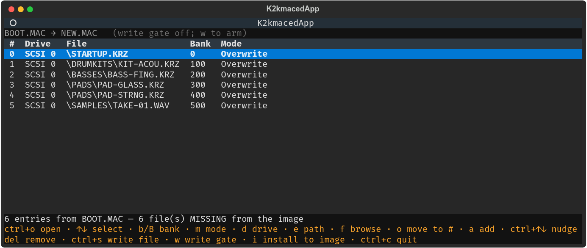
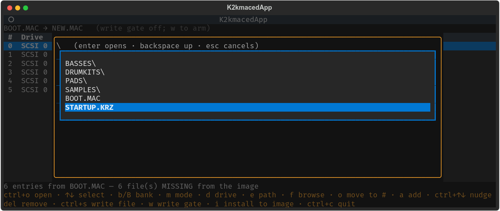
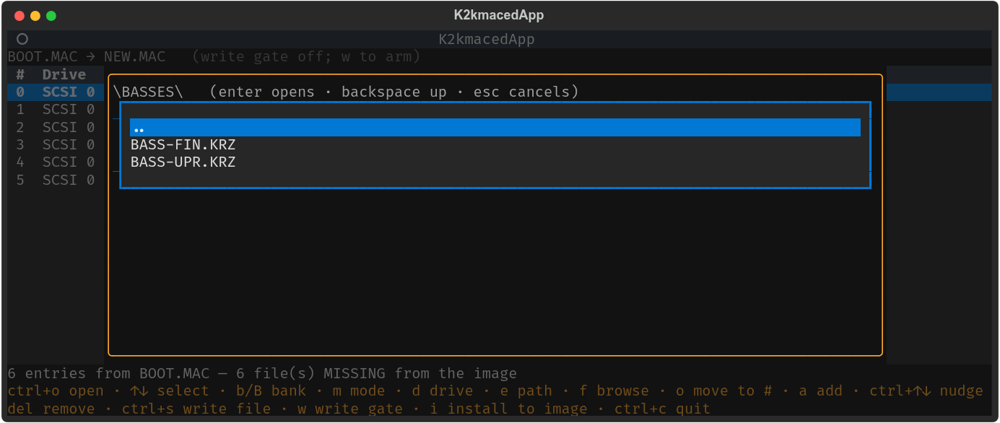
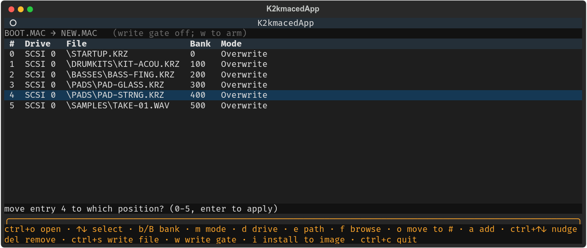
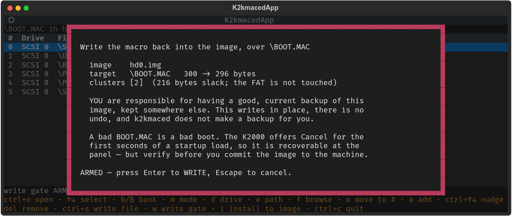

<!--
SPDX-License-Identifier: GPL-2.0-or-later
SPDX-FileCopyrightText: Copyright (C) 2026  k2kremote contributors
-->

# k2kremote

[](https://github.com/lentferj/k2kremote/actions/workflows/tests.yml)

A terminal remote for the Kurzweil **K2000 / K2000R**: it mirrors the hardware
LCD pixel-for-pixel, drives every front-panel button from the computer keyboard,
and can rename objects in one shot — all over ordinary MIDI SysEx.

It ships **two programs**: `k2kremote`, the live LCD mirror, and
[**`k2kmaced`**](#k2kmaced--the-macro-editor) — a standalone, **offline** editor
for the `BOOT.MAC` startup macro that decides what your K2000 loads at power-on.
The macro editor needs no MIDI and no running instrument, because editing
`BOOT.MAC` means the K2000 is switched **off** with its disk in your computer.

> **Author:** Jan Lentfer &lt;jan.lentfer@web.de&gt;, with AI support
> (Anthropic Claude) — see [AI assistance](#ai-assistance--human-authorship).  
> **Legal:** [DISCLAIMER.md](DISCLAIMER.md) · [LICENSE](LICENSE)

<p align="center">
  
</p>

---

## ⚠️ Use at your own risk — back up first

k2kremote is provided **as is, with absolutely no warranty and no liability** for
data loss or **hardware damage**. You assume all risk.

**During development and testing, the K2000 was occasionally driven into a
hardware lockup that could only be cleared by a _factory reset_ of the
instrument** (which can erase user data). **Before using k2kremote with real
hardware, make complete, current backups of everything on your K2000** — RAM
Programs, Setups, Samples / Keymaps, Effects, Master / MIDI settings, and any
SCSI media. Full terms: [DISCLAIMER.md](DISCLAIMER.md).

---

## AI assistance & human authorship

k2kremote was built by its human author, **Jan Lentfer**, together with
Anthropic's **Claude**. The **ideas, the project vision, and every feature** came
from the human author; Claude assisted with **writing the code** and the docs.
Crucially, the **reverse engineering rests on hands-on human work** — all of the
MIDI protocol behaviour this depends on (the SysEx flood floor, the device-id
quirk, the LCD layout, the naming model, the rename behaviour) was verified on a
real K2000R. Full account in [DISCLAIMER.md](DISCLAIMER.md).

---

## What it does

- **Mirrors the LCD** live, in several render styles (braille / blocks / text and
  a pixel-perfect colour image on graphics terminals).
- **Drives the front panel** — every button and the alpha wheel, from your
  keyboard. The F1–F6 labels are **live** (they mirror the K2000's soft keys).
- **Feedback-driven name entry** (`F9`) that types a name into the open dialog,
  reading each position back to get the case right.
- **One-shot SysEx rename tool** (`Ctrl+o`) for any object by type + id — no
  dialling letters; characters past the panel's 16-char field are flagged.
- **Event-driven refresh** (never polls), throttled output, and automatic
  pausing around heavy disk operations to protect the K2000's CPU.
- **PNG screenshots** of the LCD (`F12`) and a **MIDI panic** (`Alt+x`).
- **Edits the macro table on the *running* instrument** (⚠️ **experimental, slow**)
  — [`Ctrl+k`](#the-online-macro-editor-ctrlk--experimental-and-slow) reads the
  K2000's live load list over SysEx, reorders and repoints it, pushes it back with
  a read-back check, and can make the instrument save it to its own disk.
- **Edits your startup macro offline** — [`k2kmaced`](#k2kmaced--the-macro-editor)
  reads `BOOT.MAC` straight out of a K2000 disk image, lets you reorder the load
  steps and repoint them by browsing the disk, and can write the result back into
  the image behind a write gate. A separate program; it never opens a MIDI port.

All testing was on a real K2000R; the protocol reverse-engineering lives in the
author's sibling **mpc2emu** project (`docs/k2000r_midi_comms.md`).

---

## Render modes

`F10` cycles **auto → braille → blocks → text → image**. The K2000 LCD is a
240 × 64 pixel panel; each mode trades terminal size against fidelity.

**braille** — each character cell packs **2 × 4** pixels as Unicode braille dots,
so the whole 240 × 64 LCD fits in a compact **120 × 16** grid. The densest mode —
fits a small/short terminal — at the cost of the little dot gaps between cells.


**blocks** — solid block characters (no dot gaps), so text reads cleaner. It comes
in two flavours and k2kremote picks automatically based on the window width
(shown in the title bar as `blocks/half` or `blocks/quad`):

- **half-block** (`▀ ▄ █`): each cell is **1 pixel wide × 2 tall**, so the mirror
  is **240 columns** — a 1 : 1 match for the LCD width that keeps its wide
  3.75 : 1 aspect ratio and is the **sharpest** of the text modes. Needs a wide
  (~240-column) terminal.

  

- **quadrant** (`▘ ▚ ▛ …`): each cell is **2 × 2 pixels**, so it is only **120
  columns** and fits a normal-width terminal — at the cost of half the horizontal
  detail (and it is twice as tall as braille, ~32 rows).

  

**text** — the K2000's real **8 × 40** characters straight from ALLTEXT, with the
cursor / selection as reverse video. Crisp and exact for menus, lists and the
Disk pages.


**image** — a **pixel-perfect colour LCD** (see the top of this page), only on
graphics-capable terminals (kitty / WezTerm / sixel / iTerm2).

**auto** — picks per page: the image where the terminal supports it, otherwise
braille for graphics pages and text for text-heavy pages. (Song mode is forced to
braille even on a text terminal, because its channel-number strip is drawn as
graphics that plain text can't show.)

---

## The rename tool (`Ctrl+o`)

Pick an object **type**, enter its **id**, see the **current name**, type a **new
name**, and it is set with a single SysEx `CHANGE` message — instead of dialling
each letter on the panel. It only ever *renames* (never relocates or deletes).
Characters beyond the K2000's 16-character display field are shown in **orange**
(they are stored, but won't be visible on the panel):

<p align="center">
  
</p>

> The instrument applies the rename **from Program mode**, not while the object is
> open in its editor (the editor's own buffer wins there). For a Program, the tool
> re-selects the id afterwards so the panel and the mirror repaint with the new
> name.

---

## The online macro editor (`Ctrl+k`) — experimental and slow

> **Experimental.** Newer than the rest of this project and much less exercised.
> It drives the K2000's own panel for anything the SysEx protocol cannot express
> — browsing a directory, saving a file — and panel automation is inherently
> fragile: a dialog left open somewhere else, a cursor that did not start where
> it was expected, a soft key that means something different on another label
> page. Several such faults were found and fixed in its first sitting, and there
> is no reason to think that is all of them. **Keep a current image backup**, and
> prefer [`k2kmaced`](#k2kmaced--the-macro-editor) when the instrument can simply
> be switched off.
>
> **Watch the K2000's own LCD while you use it.** The mirror auto-pauses for the
> duration of every operation — panel navigation and object writes must not race
> the heartbeat — so the mirror is frozen at exactly the moment something might
> go wrong, and it is the hardware display that shows what the instrument is
> really doing. If a step fails it can leave the K2000 sitting in a dialog, which
> the panel shows plainly and a paused mirror does not.
>
> **Slow.** Browsing costs about 0.6 s per directory entry (see below). Editing
> and pushing are fast; looking around is not.

The macro list the K2000 replays at power-on lives in battery-backed RAM. `Ctrl+k`
reads it off the **running** instrument, edits it, and writes it back — with the
machine switched on and its disk still in it.

```
a  add entry      f  pick file from the K2000's disk     b/B  bank
e  edit path      del  remove entry                      m    mode
ctrl+↑/↓ move     r  reload from the instrument
p  push to the K2000        s  save to the K2000's disk
```

`p` arms on the first press and writes on the second, then **verifies by reading
the object back** — a `DACK` says the message was accepted, not that the bytes are
right. The previous table is saved to `~/.k2kremote-macro-backup.bin` first.
Nothing here touches a disk until you press `s`.

> **`f` is slow — about 0.6 s per directory entry.** A 25-entry directory takes
> ~16 seconds, and that is after the obvious savings: it reads the instrument's
> six-line window in one go and steps with a single alpha-wheel message instead of
> four keypresses. The floor is the ~120 ms SysEx gap this instrument needs, paid
> on every message, and there is no bulk "list a directory" command in the
> protocol — the only way to read a listing is to walk it on the panel.
>
> So pick the tool by what you are doing:
>
> | | best when |
> |---|---|
> | [`k2kmaced`](#k2kmaced--the-macro-editor) (offline) | you are **browsing a lot** — an image is read instantly and completely, and you can see the whole disk at once |
> | `Ctrl+k` (online) | you already **know the paths and can type them** (`a` then `e`), or you need the table that is in the machine *now* |
>
> Typing a path costs nothing over MIDI, so the online editor is the faster of the
> two whenever browsing is not what you need. Use `f` for the occasional lookup,
> not to explore.

---

## k2kmaced — the macro editor

A `.MAC` macro is the K2000's load list — "load this file, into that bank, in this
mode". `BOOT.MAC` in the root of the startup disk is the one the instrument
replays at power-on, so it decides what is resident after boot. Without a tool,
editing it means the front panel or a hex editor.

**`k2kmaced` is a separate program**, shipped with k2kremote but standalone: same
repo, its own command, and it never opens a MIDI port. That is arithmetic rather
than caution — on a modern setup the K2000's disk *is* its SD/CF card, so reaching
`BOOT.MAC` means the instrument is switched **off** with its disk in your
computer. The mirror needs the opposite. The two can essentially never be useful
at the same moment.

### Start it

```bash
k2kmaced                      # then ctrl+o to open a .MAC or a disk image
```

No arguments needed, because the file you want is usually on a card you have just
plugged in, under a mount point you do not remember, called `BOOT.MAC` inside a
2 GB image. If you would rather name it up front:

```bash
k2kmaced hd0.img:'\BOOT.MAC'  # a macro inside an image
k2kmaced BOOT.MAC -o NEW.MAC  # a plain file, saving elsewhere
```

Each row is one load step, in the order the K2000 replays them. **`MISSING`**
flags an entry whose file is not on the image — the failure a stale macro actually
has, which on the instrument is a "Not Found" part-way through booting.

<p align="center">
  
</p>

### Keys

| key | does |
|---|---|
| `ctrl+o` | open a `.MAC` or a disk image |
| `↑` `↓` | select an entry |
| `b` / `B` | cycle that entry's target bank up / down |
| `m` | cycle the load mode (Overwrite / Fill / …) |
| `d` | cycle the source drive |
| `f` | **browse the disk** and repoint the entry at a file |
| `e` | type a path by hand instead |
| `o` | **move the entry to a position** |
| `ctrl+↑` / `ctrl+↓` | nudge it one step |
| `a` / `delete` | add an entry / remove one |
| `ctrl+s` | write a separate `.MAC` on the host (never the image) |
| `w` then `i` | arm the write gate, then install into the image |
| `ctrl+c` | quit |

### Browsing the disk (`f`)

`enter` descends into a folder, `..` or `backspace` comes back out, `enter` on a
file repoints the current entry at it. It opens in the folder that entry already
points at, because the usual edit is "same folder, different file".

<p align="center">
  
</p>

<p align="center">
  
</p>

Only files a macro can load are listed (`.KRZ`, `.MAC`, `.AIF`, `.WAV`), so a
folder holding nothing loadable does not appear. Picking from the disk rather than
typing means the entry names a file that demonstrably exists.

### Reordering (`o`)

**Order is the macro's meaning, not its presentation.** It replays top to bottom,
so which entry loads first decides what a later one overwrites — an `Overwrite`
moved below the `Fill`s it used to precede wipes them instead of seeding them.

`o` takes the destination directly: entry 4 to position 2 gives `0,1,4,2,3`.
It **inserts rather than swaps**, because a swap would silently move a third entry
you never mentioned, and that is a *different macro* rather than a differently
drawn one.

<p align="center">
  
</p>

### What touches what

Being exact, because the dangerous parts are not where people expect:

- **Reading an image can never change it.** `k2image` has no write path at all.
- **`ctrl+s` writes one new `.MAC`** and nothing else. But it is an ordinary file
  write: point `-o` at something valuable and that file is gone. Name a new one.
- **Exactly one action writes into an image** — `i`, behind the gate and the
  arm-then-fire (or `k2kmacli install` from a script, which asks you to type
  `overwrite` instead). Everything else in either program is read-only on images.
- **The largest risk is downstream of this tool.** A macro only matters once it is
  on the instrument as `BOOT.MAC`, and a bad macro is a bad boot. Keep the
  previous `BOOT.MAC`, and keep a current image backup before writing to a K2000
  disk — not because the editor touches them, but because the next thing you do
  does.

> **Entries that point outside the image must be typed by hand — carefully.**
> The file picker (`f`) lists what is *in the image you opened*, and `check`
> validates against that same image. A macro entry can name any drive, though —
> the floppy, a second SCSI disk, a disk you have no image of — and for those
> there is nothing to browse and nothing to verify against. Such an entry is
> accepted as typed, so a typo becomes a "Not Found" at boot rather than an error
> here. Get the path from the instrument's own Disk pages if you can, and treat
> anything off-image as unchecked.
>
> Nothing in `k2kmaced` goes over MIDI. Reading the **live** Macro Table and
> pushing one back *are* implemented, and hardware-verified — but they live in
> `k2kremote` (`Ctrl+k`), which is the program that has the instrument connected,
> and they are **experimental**. This program is the settled one: it works on a
> file you can back up, with the machine switched off. See [`TODO.md`](TODO.md).

`k2kmacli` scripts the same operations from a shell — `list`, `check`,
`edit --rebank/--move`, `install`. See `k2kmacli --help`.

---

### The workflow, start to finish

Putting the above together, from a card in your hand to an instrument that boots
the way you wanted.

**0 — The instrument is switched off throughout**, and its disk is in your
computer. That is forced by the card *being* the disk, and it means nothing you do
here can be checked against the hardware until the card goes back in. The
`MISSING` column is the only verification you get.

**1 — Open the macro.** `ctrl+o`, browse to the card, pick the image; if it holds
more than one `.MAC` it asks which. Opening it this way is also what makes step 3
possible: the install target is *where you opened from*, so it can never be aimed
at the wrong file by a typo.

**2 — Edit.** Change banks, modes, drives; repoint an entry by browsing the disk
(`f`); reorder the load steps (`o`) — all as described above. Nothing so far has
touched the image.

**3 — Install it back into the image.** `w` to arm the write gate, then `i`.

> #### 🛑 Back up your image first — this is on you
>
> This step writes into your disk image **in place**. There is no undo, and
> **k2kmaced does not make a backup for you.** Keeping a good, current copy of
> that image somewhere else — a different physical disk — is your responsibility.

It is the only destructive thing `k2kmaced` does, and it is guarded in layers (the
same shape the sibling `eosed` and `s3ked` use for their erase operations):

- the **write gate** is off at start-up. `w` arms it, and the header says so —
  blinking — for as long as it is on. Opening a different file disarms it:
  permission is per-file and is never inherited.
- `i` then opens the install dialog, which shows the plan and does **nothing** on
  one keypress: `i` arms the write, `enter` fires it, `escape` cancels.
- the **destination is not typed**, so it cannot be a typo.
- the write itself only overwrites a file that already exists, within the clusters
  it already owns — so the FAT is never written — and reads the bytes back
  afterwards to confirm they landed. A `.lzo` image is refused outright, because
  those are read through a temporary copy and the write would be silently lost.

<p align="center">
  
</p>

**4 — Put the card back and power up.** `BOOT.MAC` must be in the **root** of the
startup disk, and Disk Mode's `Startup` parameter must point at that drive. You
should see *"About to load startup file…"* and then *"Macro BOOT.MAC completed"*.

Two escape hatches worth knowing: the startup screen offers a **`Cancel`** soft
button for its first few seconds, so a bad boot macro is recoverable at the panel
rather than fatal — and you can load any `.MAC` by hand from Disk Mode's `Load`
without touching `Startup` at all, which is the safer way to try one before
committing it as the boot file.

## Installation (one-time setup)

New to Python or the terminal? Follow these in order. The commands are written
for Linux/macOS; on Windows use the matching steps noted below. You only need
to do this once — after that, jump to [How to run](#how-to-run) every time you
come back.

**1. Install the prerequisites**

- **Python 3.11 or newer** — check with `python3 --version`. Install from your
  package manager or from <https://www.python.org/downloads/>.
- **Git** — to download this project (or download the ZIP from the project page
  and skip the `git clone`).
- A **MIDI interface** connected to the K2000's MIDI IN **and** OUT (only needed
  when you connect to real hardware — the `--demo` mode needs none).

**2. Download k2kremote**

```bash
git clone https://github.com/lentferj/k2kremote.git
cd k2kremote
```

**3. Create an isolated environment and install it**

```bash
python3 -m venv .venv                 # create a private virtual environment
source .venv/bin/activate             # Windows: .venv\Scripts\activate
pip install --upgrade pip

pip install -e .                      # k2kremote + all its dependencies

# optional — pixel-perfect "image" render mode (needs a graphics terminal):
pip install -e ".[image]"
```

The Kurzweil SysEx protocol library (psobot/k2000, MIT) is **vendored in-tree**
(see [`k2000/`](k2000)), so there is **no separate manual or git install** — one
`pip install -e .` pulls everything from PyPI and you are ready to go.

> On Debian/Ubuntu you can save build time by reusing system packages for the
> heavier dependencies: `sudo apt install python3-rtmidi python3-numpy`, then
> create the venv with `python3 -m venv --system-site-packages .venv` before
> `pip install -e .`.

That's it for setup. Continue to **How to run** below.

---

## How to run

**Every time you open a new terminal**, activate the environment first —
otherwise `python` resolves to your system interpreter, which doesn't have
k2kremote's dependencies installed and will fail with `ModuleNotFoundError`:

```bash
cd k2kremote                          # if not already there
source .venv/bin/activate             # Windows: .venv\Scripts\activate
```

(Alternatively, skip activation and call the venv's interpreter directly:
`.venv/bin/python -m k2kremote.app ...`, Windows: `.venv\Scripts\python -m k2kremote.app ...`.)

**Recommended first run — no hardware needed:**

```bash
python -m k2kremote.app --demo        # explore the UI; press F10 to cycle modes
python -m k2kremote.app --long-help   # full prose manual: setup, controls, safety
```

`Ctrl+c` quits. When that works, connect your K2000 (see "With a K2000 attached"
below).

### Terminals / consoles

The **text / braille / blocks** modes work in any modern terminal with a good
Unicode font (braille + block elements). The **image** mode needs an
inline-graphics protocol (kitty / sixel / iTerm2).

**Keep it simple.** A plain, "dumb" terminal that doesn't steal F-keys or Alt
shortcuts is the most trouble-free choice — then you never need `--alt-keys` at
all. Recommended simple terminals:

| Platform | Simple terminals | Image mode (graphics) |
|---|---|---|
| **Linux** | `xterm`†, [`st`](https://st.suckless.org/), [`alacritty`](https://alacritty.org/) | **kitty** (best), or WezTerm / any sixel terminal (`--image-protocol sixel`) |
| **macOS** | `alacritty`, `kitty` | kitty or iTerm2 |
| **Windows** | `alacritty`, Windows Terminal | Windows Terminal (`--image-protocol sixel`) |

> **† xterm and the Alt-chords.** xterm by default does *not* send `Alt+letter`
> as an escape sequence, so the `Alt+p/s/…` mode chords won't reach the app. Turn
> it on:
> ```bash
> xterm -fa "Monospace" -fs 12 -xrm 'XTerm*metaSendsEscape: true'
> ```
> (or put `XTerm*metaSendsEscape: true` in `~/.Xresources`). Alternatively, just
> run with **`--super-alt-keys`** and use the `m` mode leader instead — no Alt
> needed.

Rich GUI terminals (LXTerminal, GNOME Terminal, Konsole, …) often grab the F-keys
and `Alt+letter` for their own menus — that's what `--alt-keys` /
`--super-alt-keys` work around (and many let you hide the menu bar to free Alt).

> **Tested environment:** development and testing were done **only on Debian
> "Bookworm" with kitty 0.47.4**. The software has **not been tested on Windows or
> macOS**, nor on other terminals — those paths may need adjustment. Reports
> welcome.

### Other things you can run (no hardware needed)

```bash
python -m k2kremote.braille    # braille renderer self-test
python -m pytest               # the test suite — all synthetic, never opens MIDI

# The macro (.MAC) tool — entirely offline; images read-only except 'install'
k2kmacli list BOOT.MAC
k2kmacli find  ~/backups/HD0.img.lzo         # macros in an image
k2kmacli list  ~/backups/HD0.img.lzo:'\BOOT.MAC'
k2kmacli check BOOT.MAC --image ~/backups/HD0.img.lzo
k2kmacli edit  BOOT.MAC -o NEW.MAC --rebank 3=700 --move 5=0

# …or the interactive editor (a separate app; it never opens a MIDI port)
k2kmaced BOOT.MAC -o NEW.MAC --image ~/backups/HD0.img.lzo
```

A `.MAC` is the K2000's macro — the list of "load this file, into that bank, in
this mode" that `BOOT.MAC` replays at power-on. The format is documented in
[`docs/MAC_FORMAT.md`](docs/MAC_FORMAT.md). Edits are always written to a **new**
file, never to the K2000, and never over a `BOOT.MAC` whose predecessor you have
not kept. The single exception is `k2kmacli install`, which writes into a raw
image in place — see the warning in [**The macro editor**](#k2kmaced--the-macro-editor).

See [**The macro editor**](#k2kmaced--the-macro-editor) above
for the interactive version, with screenshots and what it does and does not
touch.

### With a K2000 attached

```bash
python -m k2kremote.app                  # first bidirectional MIDI port
python -m k2kremote.app --rig auto       # probe every port for the K2000
python -m k2kremote.app --port "My Port" # an exact port by name
python -m k2kremote.midi_bridge ports    # list MIDI ports
python -m k2kremote.midi_bridge probe    # auto-probe and report what answered

# Remember the selection in config.toml, then just run with no args next time
python -m k2kremote.app --port "My Port" --save-config
python -m k2kremote.app                  # reuses the saved port/rig
```

Selection precedence: an explicit `--port` / `--rig auto` overrides the config
file, which overrides the first-bidirectional-port fallback.

### `k2kmon` — the SysEx inspector

A third program, for when the mirror misbehaves and you want to see the wire
rather than reason about it. **`watch` sends nothing at all** — it opens the port
and narrates what arrives, which matters here because the instrument's SysEx
floor is ~120 ms and sustained traffic at 100 ms stalls it. A tool that chatters
while you are diagnosing becomes part of what you are diagnosing.

```bash
k2kmon types                  # the message table — read this before guessing
k2kmon watch                  # decode everything inbound, timestamped
k2kmon watch --panel          # front-panel events only
k2kmon learn                  # press buttons; it names each one
k2kmon ask paramname          # what does the K2000 say is selected?
k2kmon read Program 201       # dump an object (the fast path — see below)
k2kmon compare Program 201    # read it BOTH ways and diff the encodings
```

Two of these repay knowing about before you need them:

**`read` is roughly twenty times faster than the panel.** Reading a program's
filter page by driving the editor costs about ten seconds and gives you one page
of one layer; `Read` returns the entire object, every layer, in about half a
second. A hundred programs is fifty seconds against a quarter of an hour.

**`compare` is a decoder self-check.** `form` selects only how the data is packed
for transmission — 4 bits per MIDI byte or 7 — so both forms carry the same object
and **must** decode identically. It is a command because ours did *not* for a
while: a left-aligned bit stream was being front-padded like a right-justified
numeric field, so every byte came out shifted by two bits, and the difference was
briefly mistaken for a property of the protocol. `k2kmon read` names the encoding
in its header so any recurrence stays visible after the fact.

`learn` is the one that pays for the tool. With `XMIT Bttns` on, the panel
reports what a human actually pressed — a better authority than counting your own
keypresses, which is how this project ended up with a soft-key cycle one short
and a cursor two fields away from where it thought it was.

---

## Command-line options

Run `python -m k2kremote.app --help` for this list, or `--long-help` for a full
prose manual (setup, terminals, controls, safety).

**Connection**

| Option | Default | Description |
|---|---|---|
| `--rig {auto,standard}` | `standard` | How to find the K2000: `standard` uses one bidirectional MIDI port; `auto` probes every port for a K2000 that answers SysEx. |
| `--port NAME` | — | Exact MIDI port name to use (implies `--rig standard`). List names with `python -m k2kremote.midi_bridge ports`. |
| `--config FILE` | `config.toml` | TOML file remembering the port/rig selection (ignored if absent). |
| `--save-config` | off | Write the effective port/rig selection to `--config`, so later runs need no flags. |
| `-i, --sysex-interval MS` | `150` | Minimum delay between outgoing SysEx messages (like `amidi -i`), clamped to the RE'd 120 ms floor. Lower = snappier UI, but more risk of garbling the K2000's LCD; raise it to `500` for unattended runs. |

**Display**

| Option | Default | Description |
|---|---|---|
| `--text` | off (auto) | Start in fast text (ALLTEXT) mode instead of auto. Cycle modes live with `F10`. |
| `--image-protocol {auto,tgp,sixel,halfcell}` | `auto` | Terminal graphics protocol for image mode. Force `tgp` (kitty), `sixel` (WezTerm/Windows Terminal), or `halfcell` (universal text fallback). |
| `--image-cols N` | `120` | Cap the pixel image at N columns so it isn't huge on wide monitors (height follows the LCD aspect). |
| `--model NAME` | `K2000R` | Model label shown in the title bar. |

**Behaviour**

| Option | Default | Description |
|---|---|---|
| `--settle MS` | `150` | Delay after a keypress before reading the redrawn LCD. Lower = snappier; setting it too low only costs one cheap re-read, since the mirror takes a second look when the screen comes back unchanged. |
| `--heartbeat MS` | `1200` | Idle refresh cadence. A quiet poll reads only the 321-byte text plane and stops there when nothing changed, so it is ~8x cheaper than a full frame; lower = front-panel changes appear sooner. |
| `--alt-keys` | off | Show terminal-safe key alternates (`a`–`h` soft keys, `Ctrl+e/x/n/v/g`) in the legend and soft-key bar — for terminals that intercept the F-keys (Alt-chords stay). |
| `--super-alt-keys` | off | Everything `--alt-keys` does, plus move the mode buttons to the `m` leader (press `m`, then `p/s/q/m/i/d/g/e`) — for terminals that also grab the `Alt+letter` mode chords. |
| `--manual-refresh` | off | Disable the periodic heartbeat entirely; refresh only on front-panel events and `Ctrl+r`. The strongest guard against polling the K2000 during a delete/save (a poll landing mid-rewrite can lock up the unit). |
| `--demo` | off | Run against a static synthetic frame with no MIDI — try the UI and render modes without any hardware. |
| `--print-size` | — | Print `COLSxROWS` to open the window at — the size the app was last closed at, or the smallest that shows the mirror uncompromised — and exit. |
| `--long-help` | — | Print the full prose user manual and exit. |
| `-h, --help` | — | Print the option summary and exit. |

---

## Controls

Your keyboard drives the K2000's front panel. The **F1–F6 labels are live** —
they mirror the K2000's own soft-key row for the current page.

### Front panel

| Key | K2000 | | Key | K2000 |
|---|---|---|---|---|
| `F1`–`F6` | Soft A–F | | `0`–`9` | digits |
| `F7` / `F8` | Edit / Exit | | `+`/`-` or `PgUp`/`PgDn` | value Plus / Minus |
| `↑ ↓ ← →` | cursor | | `[` / `]` | Chan/Bank − / + |
| `Enter` | Enter | | `Ctrl+↑` / `Ctrl+↓` | alpha-wheel ±1 |
| `Esc` | **Exit** (back out) | | `Ctrl+PgUp`/`Ctrl+PgDn` | alpha-wheel ±5 |
| `Backspace` | Clear | | `Delete` | Cancel |

### Mode buttons (Alt-chords)

| Key | Mode | | Key | Mode |
|---|---|---|---|---|
| `Alt+p` | Program | | `Alt+i` | MIDI |
| `Alt+s` | Setup | | `Alt+d` | Disk |
| `Alt+q` | Quick-Access | | `Alt+g` | Song |
| `Alt+m` | Master | | `Alt+e` | Effects |

> **GTK terminals (e.g. LXTerminal) grab `Alt+letter` for their menu bar**, so
> the mode chords never reach the app. Run with **`--super-alt-keys`** and the
> modes move to a **leader key**: press **`m`**, then the mode's lowercase letter
> (`m` then `d` = Disk). Plain keys, no terminal intercepts them. (Plain
> `--alt-keys` keeps the Alt-chords and only remaps the F-keys.)

### App

| Key | Action |
|---|---|
| `F9` | Name-entry overlay — type a name, `Enter` sends it (feedback-driven), `Esc` cancels |
| `Ctrl+o` | **Rename object** tool — type + id + new name → one SysEx message |
| `F11` | **Master functions** tool — delete object / move-relocate / delete one type's bank / delete every type in a bank / delete EVERYTHING, each via one SysEx, bypassing the LCD menu. Destructive: two-step confirm + auto-pause. (Not `Ctrl+M` — terminals send that as Enter; `--alt-keys` offers `Ctrl+u`.) |
| `F10` | Cycle render mode: **auto → braille → blocks → text → image** |
| `F12` | Save the current screen as a PNG (`k2kremote-<timestamp>.png`) |
| `Alt+x` | **Panic** — MIDI all-notes-off on all 16 channels |
| `Alt+End` | In a name dialog: jump the cursor to the end of the name |
| `p` | **Pause / resume** the mirror (no MIDI traffic) — the universal resume key: lifts a manual, disk-op, or confirm-screen pause |
| `Ctrl+r` | **Force** a full screen refresh now (works even while paused; also releases a confirm-screen pause) |
| `Ctrl+c` | Quit |

> **⚠ Disk & delete operations.** The K2000's CPU can crash under MIDI traffic
> while it is busy — a SCSI **Load**/**Save**, or rewriting its object table for a
> **delete**. A screen poll landing in that window can **lock up** the unit (needs
> a factory reset to clear). Guards: (1) k2kremote **auto-pauses** when you press a
> soft key whose label is a heavy op (Load/Save/Move/Format/…); (2) it **auto-pauses
> the mirror entirely** when a **confirmation prompt** is on screen — a bare
> **Yes/No** pair, or text "are you sure" — since the next press commits the
> rewrite; earlier idle screens (the delete *selection* list, object menus) stay
> live so you can navigate them; (3) **`--manual-refresh`** drops the periodic poll
> entirely. All three show one **`⏸ PAUSED · <reason>`** badge (manual / disk op /
> confirm) and all resume with **`p`** (the confirm pause also releases on
> `Ctrl+r`). **Best-effort caveat:** the auto-pause depends on reading the confirm
> screen *before* you press Yes, so for guaranteed safety press **`p`** yourself
> before any delete/save — that stops all MIDI regardless of what's on screen.

### If your terminal eats F-keys

Some terminals intercept function keys. Every F-key function has a terminal-safe
alternate:

| F-key | Alternate | |
|---|---|---|
| `F1`–`F6` (soft A–F) | `a` `s` `d` `f` `g` `h` | home-row run (QWERTY/QWERTZ) |
| `F7` / `F8` (Edit/Exit) | `Ctrl+e` / `Ctrl+x` | |
| `F9` (name entry) | `Ctrl+n` | |
| `F10` (view mode) | `Ctrl+v` | |
| `F12` (PNG) | `Ctrl+g` | |

> **`--alt-keys`** shows these alternates (`[a:Octav-]`, `Ctrl+n name`, …) in the
> legend and soft-key bar instead of the F-keys, so the hints match what works in
> your terminal. The Alt+letter mode chords are left alone. If your terminal also
> grabs Alt (see the mode-buttons note above), use **`--super-alt-keys`**, which
> additionally moves the modes to the `m` leader.
>
> The key-hint legend stays visible as you navigate (it is no longer hidden by
> the label of the last key you pressed).

> **Safety:** the destructive object commands (DEL / DELBANK / MOVEBANK) are
> deliberately **not bound to any key** — they can wipe RAM and must never fire
> from a keystroke.

---

## Modules

| Module | Role |
|---|---|
| `k2kremote/midi_bridge.py` | Portable MIDI transport — a single bidirectional port (`standard`) or auto-probe (`autodetect`), throttled output, device-id handling, and the SysEx rename/lookup. |
| `k2kremote/braille.py` | Renders the 240×64 LCD pixel buffer as a braille / blocks / half-block mirror. |
| `k2kremote/keymap.py` | Maps Textual key events onto K2000 front-panel buttons / alpha-wheel turns. |
| `k2kremote/refresh.py` | Event-driven (never-poll) refresh scheduler: press → settle → refresh, plus an idle heartbeat, on one throttled output stream. |
| `k2kremote/text_entry.py` | Feedback-driven name entry — types a name into the open dialog, reading each position back to fix case. |
| `k2kremote/name_cursor.py` | Software model of the name-edit cursor (the K2000 never exposes it over MIDI), drawn as the underline. |
| `k2kremote/screenshot.py` | Saves a captured screen as a high-fidelity PNG (reuses psobot/k2000's `image`). |
| `k2kremote/app.py` | The Textual TUI: the LCD mirror, live F1–F6 soft bar, mode/status lines, name entry, the rename tool, render-mode cycling. |
| `k2kmaced/macfile.py` | Reads, edits and writes `.MAC` macro files (and the `PRAM` container they share with `.KRZ` banks). |
| `k2kmaced/k2image.py` | Read-only reader for K2000 FAT16 disk images, raw or `lzop`-compressed — where the macros and the banks they load live. |
| `k2kmaced/k2write.py` | The one write direction: overwrites a file that already exists inside an image, within the clusters it already owns, so the FAT is never touched. |
| `k2kmaced/cli.py` | `k2kmacli` — list / check / edit / build macros, from a file or from inside an image. |
| `k2kmaced/app.py` | `k2kmaced` — the standalone macro editor (TUI only): reorder entries, cycle drive / bank / load mode, browse the image for an entry's file, flag files the image no longer has, and install the result back into the image behind a write gate. |
| `k2kmaced/mpc2emu_link.py` | Optional bridge to a sibling mpc2emu checkout, used to look inside the `.KRZ` banks a macro references. |
| `k2kremote/disk_browse.py` | Reads the K2000's own disk directory by driving its Load browser — never presses OK, so it can only look. |
| `k2kremote/macro_save.py` | Makes the instrument save its macro table to disk, checking the drive and the typed filename first. |
| `k2kremote/monitor.py` | `k2kmon` — the SysEx inspector: decode the wire passively, name panel presses, send one request at a time, dump objects. |

See [DESIGN.md](DESIGN.md) for the architecture and [TODO.md](TODO.md) for open
items.

---

## Requirements

All installed automatically by `pip install -e .`:

- Python 3.11 or later
- [`textual`](https://pypi.org/project/textual/) — the TUI
- [`python-rtmidi`](https://pypi.org/project/python-rtmidi/) — cross-platform MIDI I/O
- [`numpy`](https://pypi.org/project/numpy/)
- [`attrs`](https://pypi.org/project/attrs/)
- [`pillow`](https://pypi.org/project/pillow/)
- the [psobot/k2000](https://github.com/psobot/k2000) SysEx protocol library — **vendored in-tree** ([`k2000/`](k2000), MIT), no separate install
- _optional:_ [`textual-image`](https://pypi.org/project/textual-image/) for pixel-perfect image mode (`pip install -e ".[image]"`)

---

## License and Third-Party Sources

Released under the **GNU General Public License v2.0 or later
(GPL-2.0-or-later)** — see [`LICENSE`](LICENSE).

The Kurzweil SysEx protocol library is **vendored** under [`k2000/`](k2000)
under its own MIT license (kept intact in [`k2000/LICENSE`](k2000/LICENSE)); the
rest of the project is original GPL-2.0-or-later work. MIT is compatible with the
GPL, and the MIT terms continue to apply to the files in `k2000/`.

| File / dir | Reference | License | Author |
|---|---|---|---|
| `k2000/` | [psobot/k2000](https://github.com/psobot/k2000) — the full SysEx protocol library, **vendored verbatim** so the app runs out of the box | MIT | Peter Sobot |
| `midi_bridge.py` | Connection plumbing (throttled output, merged multi-input, connect logic) ported from the author's sibling mpc2emu project; MIDI quirks RE'd in its `docs/k2000r_midi_comms.md`, verified on real K2000R hardware | GPL-2.0-or-later | Original code |
| `braille.py` | Original work — renders the K2000's LCD pixel buffer | GPL-2.0-or-later | Original code |
| `text_entry.py` / `name_cursor.py` | Naming model from the Kurzweil K2vx manual; button codes from the vendored `k2000.definitions.Button` (MIT) | GPL-2.0-or-later | Original code |
| `macfile.py` | Macro semantics from the Kurzweil K2vx manual ch. 13; `PRAM` container framing from mpc2emu's `docs/KRZ_FORMAT.md` §2; verified against a real `BOOT.MAC` (see [`docs/MAC_FORMAT.md`](docs/MAC_FORMAT.md)) | GPL-2.0-or-later | Original code |
| `k2image.py` / `cli.py` | Original work — FAT16 read direction for K2000 volumes, and the macro command-line tool | GPL-2.0-or-later | Original code |
| `mpc2emu_link.py` | Optional bridge to the author's sibling [mpc2emu](https://github.com/lentferj/mpc2emu) project (`parsers/krz_parser.py`, `writers/fat16.py`) | GPL-2.0-or-later | Original code |

---

*Kurzweil is a trademark of Young Chang Co. Ltd. All other trademarks are
property of their respective owners. This project is not affiliated with or
endorsed by Young Chang / Kurzweil.*
